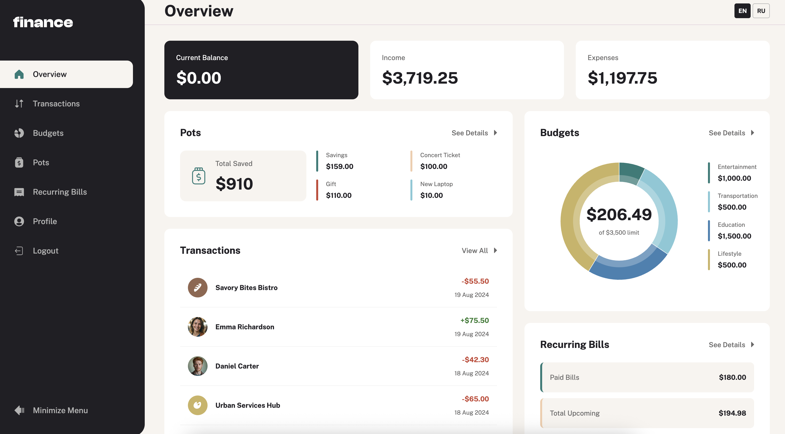

# Frontend Mentor - Personal finance app solution

This is a solution to the [Personal finance app challenge on Frontend Mentor](https://www.frontendmentor.io/challenges/personal-finance-app-JfjtZgyMt1). Frontend Mentor challenges help you improve your coding skills by building realistic projects.

## Table of contents

- [Overview](#overview)
  - [The challenge](#the-challenge)
  - [Screenshot](#screenshot)
- [My process](#my-process)
  - [Built with](#built-with)
- [Author](#author)

## Overview

### The challenge

Users should be able to:

- See all of the personal finance app data at-a-glance on the overview page
- View all transactions on the transactions page with pagination for every ten transactions
- Search, sort, and filter transactions
- Create, read, update, delete (CRUD) budgets and saving pots
- View the latest three transactions for each budget category created
- View progress towards each pot
- Add money to and withdraw money from pots
- View recurring bills and the status of each for the current month
- Search and sort recurring bills
- Receive validation messages if required form fields aren't completed
- Navigate the whole app and perform all actions using only their keyboard
- View the optimal layout for the interface depending on their device's screen size
- See hover and focus states for all interactive elements on the page
- **Bonus**: Save details to a database (build the project as a full-stack app)
- **Bonus**: Create an account and log in (add user authentication to the full-stack app)

### Screenshot

### Links

- Solution URL: [https://github.com/K-ost/personal-finance](https://github.com/K-ost/personal-finance)
- Live Site URL: [https://k-ost.github.io/personal-finance/login](https://k-ost.github.io/personal-finance/login)

## My process

### Built with

- Semantic HTML5 markup
- Flexbox
- CSS Grid
- Mobile-first workflow
- [React](https://reactjs.org/) - JS library
- [React MUI](https://mui.com/) - Styling library
- [Zustand](https://zustand-demo.pmnd.rs/) - State Manager
- [TanStack Query](https://tanstack.com/query/v3/) - for API server requests
- [React Testing Library](https://testing-library.com/docs/react-testing-library/intro/) - for tests along with Vitest

## Author

- Website - [https://github.com/K-ost](https://github.com/K-ost)
- Frontend Mentor - [@K-ost](https://www.frontendmentor.io/profile/K-ost)
